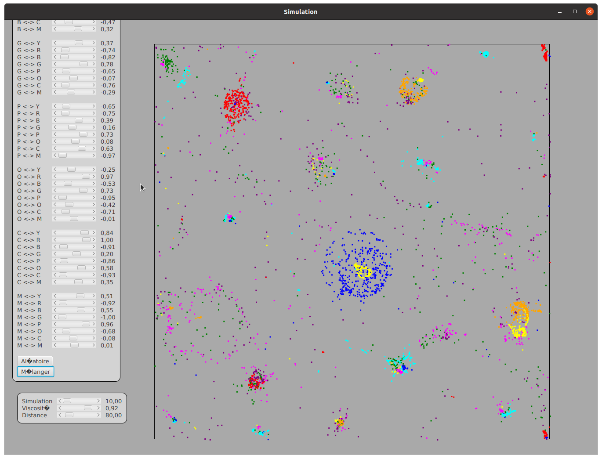

# Simulateur de particules

Ce projet consiste en la simulation de millier de particules différentes. \
8 couleurs, des règles différentes et modifiables entres chacunes d'elles. \
Et voilà !

## Info

Projet sous JavaSE-16 \
Eclipe 2021-12 (4.22.0) \
Utilisation de Maven pour ajouter JavaFX
